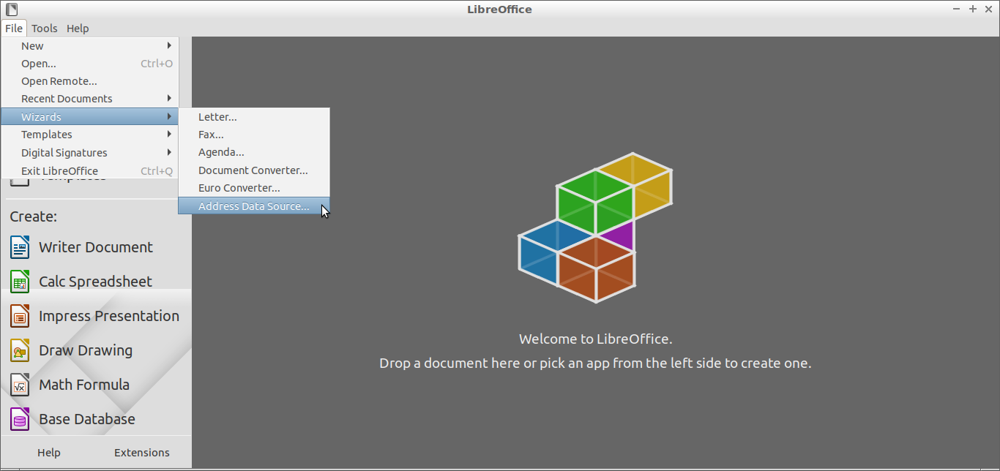
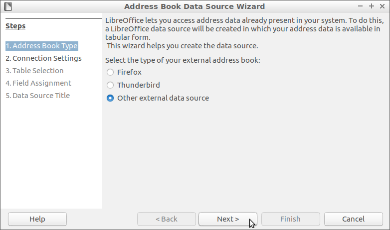
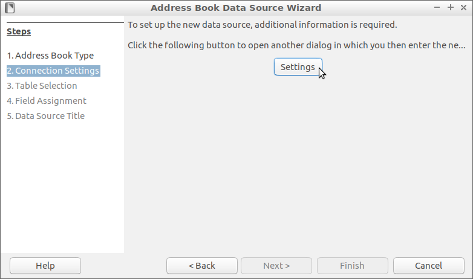
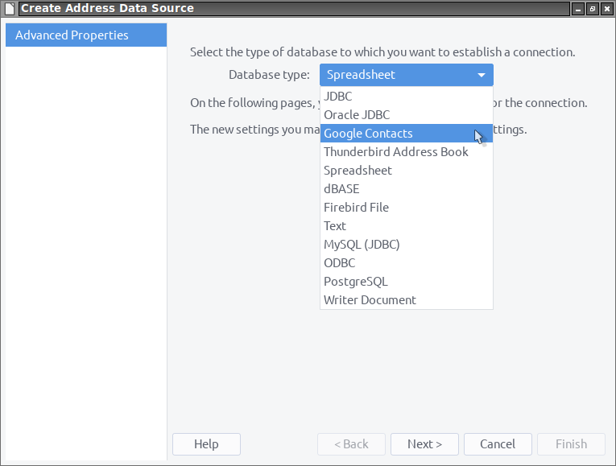
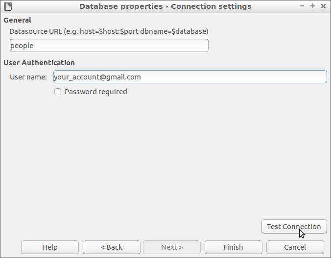
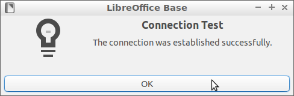

**Ce [document](https://prrvchr.github.io/gContactOOo/README_fr) en français.**

**The use of this software subjects you to our** [**Terms Of Use**](https://prrvchr.github.io/gContactOOo/gContactOOo/registration/TermsOfUse_en) **and** [**Data Protection Policy**](https://prrvchr.github.io/gContactOOo/gContactOOo/registration/PrivacyPolicy_en)

# version [0.0.6](https://prrvchr.github.io/gContactOOo#historical)

## Introduction:

**gContactOOo** is part of a [Suite](https://prrvchr.github.io/) of [LibreOffice](https://www.libreoffice.org/download/download/) and/or [OpenOffice](https://www.openoffice.org/download/index.html) extensions allowing to offer you innovative services in these office suites.  
This extension gives you access to your phone contacts in LibreOffice / OpenOffice (the contacts of your Android phone).

Being free software I encourage you:
- To duplicate its [source code](https://github.com/prrvchr/gContactOOo).
- To make changes, corrections, improvements.
- To open [issue](https://github.com/prrvchr/gContactOOo/issues/new) if needed.

In short, to participate in the development of this extension.  
Because it is together that we can make Free Software smarter.

## Requirement:

gContactOOo uses a local [HsqlDB](http://hsqldb.org/) database of version 2.5.1.  
The use of HsqlDB requires the installation and configuration within LibreOffice / OpenOffice of a **JRE version 1.8 minimum** (ie: Java version 8)  
I recommend [AdoptOpenJDK](https://adoptopenjdk.net/) as your Java installation source.

If you are using **LibreOffice on Linux**, then you are subject to [bug 139538](https://bugs.documentfoundation.org/show_bug.cgi?id=139538).  
To work around the problem, please uninstall the packages:
- libreoffice-sdbc-hsqldb
- libhsqldb1.8.0-java

If you still want to use the Embedded HsqlDB functionality provided by LibreOffice, then install the [HsqlDBembeddedOOo](https://prrvchr.github.io/HsqlDBembeddedOOo/) extension.  
OpenOffice and LibreOffice on Windows are not subject to this malfunction.

## Installation:

It seems important that the file was not renamed when it was downloaded.
If necessary, rename it before installing it.

- Install [OAuth2OOo.oxt](https://github.com/prrvchr/OAuth2OOo/raw/master/OAuth2OOo.oxt) extension version 0.0.5.

You must install this extension, if it is not already installed.

- Install [HsqlDBDriverOOo.oxt](https://github.com/prrvchr/HsqlDBDriverOOo/raw/master/HsqlDBDriverOOo.oxt) extension version 0.0.4.

You must install this extension, if it is not already installed.

- Install [gContactOOo.oxt](https://github.com/prrvchr/gContactOOo/raw/master/gContactOOo.oxt) extension version 0.0.6.

Restart LibreOffice / OpenOffice after installation.

## Use:

In LibreOffice / OpenOffice go to File -> Wizards -> Address Data Source...:

In step: 1. Address Book Type:
- select: Other external data source
- click on: Next(Button)

In step: 2. Connection Settings:
- click on: Settings(Button)

In Database type list:
- select: Google Contacts
- click on: Next(Button)

In General: Datasource Url:
- put: your Google account (ie: your_account@gmail.com)

Then:
- click on: Test connection (button)

After authorizing the [OAuth2OOo](https://prrvchr.github.io/OAuth2OOo) application to access your Contacts, normally you should see: Connection Test: The connection was established successfully.

Have fun...

## Has been tested with:

* LibreOffice 6.4.4.2 - Ubuntu 20.04 -  LxQt 0.14.1

* LibreOffice 7.0.0.0.alpha1 - Ubuntu 20.04 -  LxQt 0.14.1

* OpenOffice 4.1.8 x86_64 - Ubuntu 20.04 - LxQt 0.14.1

* OpenOffice 4.2.0.Build:9820 x86_64 - Ubuntu 20.04 - LxQt 0.14.1

* LibreOffice 6.1.5.2 - Raspbian 10 buster - Raspberry Pi 4 Model B

* LibreOffice 6.4.4.2 (x64) - Windows 7 SP1

I encourage you in case of problem :-(  
to create an [issue](https://github.com/prrvchr/gContactOOo/issues/new)  
I will try to solve it ;-)

## Historical:

### Introduction:

This extension was written in order to make usable in free software (LibreOffice or OpenOffice) your personal data (your address book) stored in your Android phone.

When the [smtpMailerOOo](https://github.com/prrvchr/smtpMailerOOo/blob/master/smtpMailerOOo.oxt) extension is finally available, it will be the data source for [mail merge](https://en.wikipedia.org/wiki/Mail_merge) by email, to your correspondents contained in your phone.

It will give you access to an information system that only larges companies are able, today, to implement.

### What has been done for version 0.0.5:

- Integration and use of the new Hsqldb v2.5.1.

- Writing of a new [Replicator](https://github.com/prrvchr/gContactOOo/blob/master/CloudContactOOo/python/cloudcontact/replicator.py) interface, launched in the background (python Thread) responsible for:

    - Perform the necessary procedures when creating a new user (initial Pull).

- Writing of a new [DataBase](https://github.com/prrvchr/gContactOOo/blob/master/CloudContactOOo/python/cloudcontact/database.py) interface, responsible for making all calls to the database.

- Many other fix...

### What has been done for version 0.0.6:

- Driver has a new name: **Google Contacts**

- Driver is now registred for a new protocol: **sdbc:address:google:your_account@gmail.com**

- The [HsqlDBDriverOOo](https://github.com/prrvchr/HsqlDBDriverOOo/raw/master/HsqlDBDriverOOo.oxt) extension now provides the driver needed to access the HsqlDB database used by gContactOOo.

- Modifying the [Replicator](https://github.com/prrvchr/gContactOOo/blob/master/CloudContactOOo/python/cloudcontact/replicator.py) in order to: 
    - Open and close the database at each replication.
    - Go on hold after the last closing of the address book.
    - Unload when closing LibreOffice / OpenOffice.

- Possibility to open the local HsqlDB database by: Tools -> Options -> Internet -> gContactOOo -> View DataBase

- Many other fix...

### What remains to be done for version 0.0.6:

- Make the address book locally editable with replication of changes.

- Add new languages for internationalization...

- Anything welcome...
