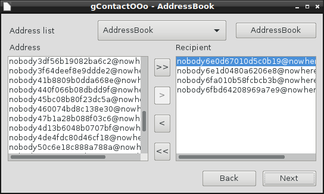

# gContactOOo

## Google Contact integration for LibreOffice.

## Has been tested with:
	
* LibreOffice 5.3.3.2 - Lubuntu 16.10 -  LxQt 0.11.0.3

I encourage you in case of problem to create an [issue](https://github.com/prrvchr/gContactOOo/issues/new)
I will try to solve it :-)

## Requirements:

* Google Mail:
	
Load: [Google Account Setting](https://myaccount.google.com/security?utm_source=OGB#connectedapps)

You must enable less secured application.

* Mozilla Thunderbird:

You need [Thunderbird 38.5.1 or higher](https://www.mozilla.org/thunderbird/)

You need [gContactSync 2.0.10 or higher](https://addons.mozilla.org/en-US/thunderbird/addon/gcontactsync/), you can install it in the Thunderbird extention manager.

* Libre Office:

You need [LibreOffice 5.0.5 or higher](https://www.libreoffice.org/download/libreoffice-fresh/)

## Configuration:

In Writer go to Tools -> Options -> LibreOffice Writer -> Mail Merge E-mail:
put your Name, your email address, server name (ie: smtp.gmail.com), port (587) and check "Use secure connection (SSL)"
In Server Authentication put your email address again and your password.
Go back and normally you can test the connection. It must operate...
  
In Writer go to Tools -> Address Book Source -> Address Data Source(Button) -> Thunderbird/icedove -> Next(Button)
-> AddressBook(in the list) -> Next(Button) and Finish(Button)

In Writer go to Tools -> Add-Ons -> gContactOOo:
Normally you can see your Address Book.
  
 ## Use:

In Writer go to Insert -> Field -> More Fields. In database Selection under your address database, choose any field from the "gContactOOo" query.

In Writer go to Tools -> Add-Ons -> gContactOOo

Have fun...