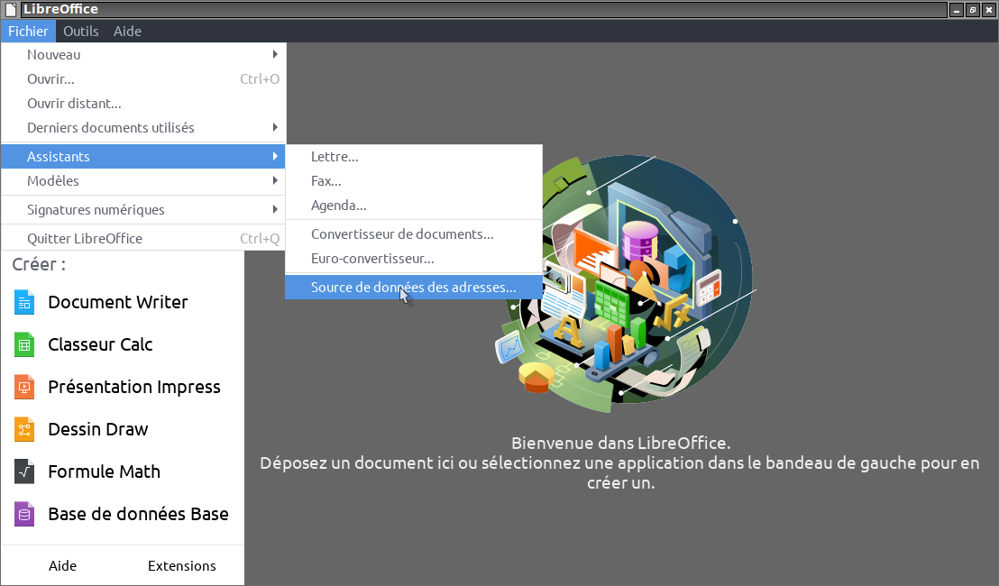
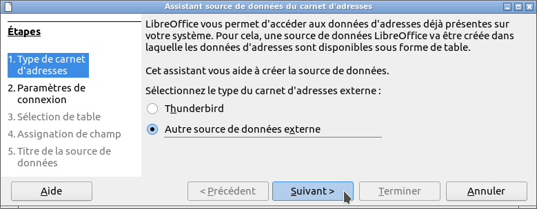
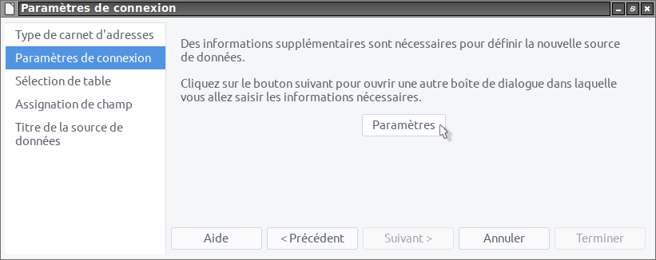
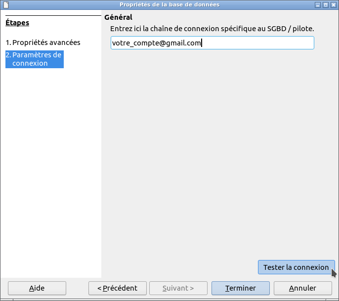
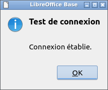

# ![gContactOOo logo][1] gContactOOo

**This [document][2] in English.**

**L'utilisation de ce logiciel vous soumet à nos** [**Conditions d'utilisation**](https://prrvchr.github.io/gContactOOo/source/gContactOOo/registration/TermsOfUse_fr) **et à notre** [**Politique de protection des données**](https://prrvchr.github.io/gContactOOo/source/gContactOOo/registration/PrivacyPolicy_fr)

# version [0.0.6](https://prrvchr.github.io/gContactOOo/README_fr#historique)

## Introduction:

**gContactOOo** fait partie d'une [Suite](https://prrvchr.github.io/README_fr) d'extensions [LibreOffice](https://fr.libreoffice.org/download/telecharger-libreoffice/) et/ou [OpenOffice](https://www.openoffice.org/fr/Telecharger/) permettant de vous offrir des services inovants dans ces suites bureautique.  
Cette extension vous donne l'acces à vos contacts téléphonique dans LibreOffice / OpenOffice (les contacts de votre téléphone Android).

Etant un logiciel libre je vous encourage:
- A dupliquer son [code source](https://github.com/prrvchr/gContactOOo).
- A apporter des modifications, des corrections, des améliorations.
- D'ouvrir un [dysfonctionnement](https://github.com/prrvchr/gContactOOo/issues/new) si nécessaire.

Bref, à participer au developpement de cette extension.  
Car c'est ensemble que nous pouvons rendre le Logiciel Libre plus intelligent.

## Prérequis:

gContactOOo utilise une base de données locale [HsqlDB](http://hsqldb.org/) version 2.5.1.  
HsqlDB étant une base de données écrite en Java, son utilisation nécessite [l'installation et la configuration](https://wiki.documentfoundation.org/Documentation/HowTo/Install_the_correct_JRE_-_LibreOffice_on_Windows_10/fr) dans LibreOffice / OpenOffice d'un **JRE version 11 ou ultérieure**.  
Je vous recommande [Adoptium](https://adoptium.net/releases.html?variant=openjdk11) comme source d'installation de Java.

Si vous utilisez **LibreOffice sous Linux**, alors vous êtes sujet au [dysfonctionnement 139538](https://bugs.documentfoundation.org/show_bug.cgi?id=139538).  
Pour contourner le problème, veuillez désinstaller les paquets:
- libreoffice-sdbc-hsqldb
- libhsqldb1.8.0-java

Si vous souhaitez quand même utiliser la fonctionnalité HsqlDB intégré fournie par LibreOffice, alors installez l'extension [HsqlDBembeddedOOo](https://prrvchr.github.io/HsqlDBembeddedOOo/README_fr).  
OpenOffice et LibreOffice sous Windows ne sont pas soumis à ce dysfonctionnement.

## Installation:

Il semble important que le fichier n'ait pas été renommé lors de son téléchargement.  
Si nécessaire, renommez-le avant de l'installer.

- Installer l'extension  **[OAuth2OOo.oxt](https://github.com/prrvchr/OAuth2OOo/raw/master/OAuth2OOo.oxt)** version 0.0.6.

Vous devez installer cette extension, si elle n'est pas déjà installée.

- Installer l'extension  **[jdbcDriverOOo.oxt](https://github.com/prrvchr/jdbcDriverOOo/raw/master/source/jdbcDriverOOo/dist/jdbcDriverOOo.oxt)** version 0.0.4.

Vous devez installer cette extension, si elle n'est pas déjà installée.

- Installer l'extension  **[gContactOOo.oxt](https://github.com/prrvchr/gContactOOo/raw/master/source/gContactOOo/dist/gContactOOo.oxt)** version 0.0.6.

Redémarrez LibreOffice / OpenOffice après l'installation.

## Utilisation:

Dans LibreOffice / OpenOffice aller à: Fichier -> Assistants -> Source de données des adresses...:

À l'étape: 1. Type de carnet d'adresses:
- sélectionner: Autre source de données externes
- cliquez sur: Suivant (bouton)

À l'étape: 2. Paramètres de Connexion:
- cliquez sur: Paramètres (bouton)

Dans Type de base de données:
- sélectionner: Contacts Google
- cliquez sur: Suivant (bouton)

Dans Général: URL de la source de données:
- mettre: votre compte Google (c'est-à-dire: votre_compte@gmail.com)

Puis:
- cliquez sur: Tester la connexion (bouton)

Après avoir autorisé l'application [OAuth2OOo](https://prrvchr.github.io/OAuth2OOo/README_fr) à accéder à vos contacts, normalement vous devez voir s'afficher: Test de connexion: Connexion établie.

Maintenant à vous d'en profiter...

## A été testé avec:

* LibreOffice 6.4.4.2 - Ubuntu 20.04 -  LxQt 0.14.1

* LibreOffice 7.0.0.0.alpha1 - Ubuntu 20.04 -  LxQt 0.14.1

* OpenOffice 4.1.8 x86_64 - Ubuntu 20.04 - LxQt 0.14.1

* OpenOffice 4.2.0.Build:9820 x86_64 - Ubuntu 20.04 - LxQt 0.14.1

* LibreOffice 6.1.5.2 - Raspbian 10 buster - Raspberry Pi 4 Model B

* LibreOffice 6.4.4.2 (x64) - Windows 7 SP1

Je vous encourage en cas de problème :-(  
de créer un [dysfonctionnement](https://github.com/prrvchr/gContactOOo/issues/new)  
J'essaierai de le résoudre ;-)

## Historique:

### Introduction:

Cette extension a été écrite afin de rendre utilisables dans un logiciel libre (LibreOffice ou OpenOffice) vos données personnelles (votre carnet d'adresses) stockées dans votre téléphone Android.

Avec l'extension [smtpMailerOOo](https://github.com/prrvchr/smtpMailerOOo/blob/master/source/smtpMailerOOo/dist/smtpMailerOOo.oxt), elle peut être la source de données pour des [publipostages](https://fr.wikipedia.org/wiki/Publipostage) par courriel (email), à vos correspondants contenus dans votre téléphone.

Elle vous donnera accès à un système d'information que seules les grandes entreprises sont capables, aujourd'hui, de mettre en œuvre.

### Ce qui a été fait pour la version 0.0.5:

- Intégration et utilisation de la nouvelle version de Hsqldb 2.5.1.

- Ecriture d'une nouvelle interface [Replicator](https://github.com/prrvchr/gContactOOo/blob/master/uno/lib/uno/addressbook/replicator.py), lancé en arrière-plan (python Thread) responsable de:

    - Effectuer les procédures nécessaires lors de la création d'un nouvel utilisateur (Pull initial).

- Ecriture d'une nouvelle interface [DataBase](https://github.com/prrvchr/gContactOOo/blob/master/uno/lib/uno/addressbook/database.py), responsable de tous les appels à la base de données.

- Beaucoup d'autres correctifs...

### Ce qui a été fait pour la version 0.0.6:

- Le pilote a un nouveau nom: **Contacts Google**

- Le pilote est maintenant enregistré pour un nouveau protocole: **sdbc:address:google:votre_compte@gmail.com**

- L'extension [jdbcDriverOOo](https://github.com/prrvchr/jdbcDriverOOo/raw/master/source/jdbcDriverOOo/dist/jdbcDriverOOo.oxt) fournit désormais le pilote nécessaire pour accéder à la base de données HsqlDB utilisée par gContactOOo.

- Modification du [Replicator](https://github.com/prrvchr/gContactOOo/blob/master/uno/lib/uno/addressbook/replicator.py) afin de:
    - Ouvrir et fermer la base de données à chaque réplication.
    - Se mettre en attente après la dernière fermeture du carnet d'adresses.
    - Se décharger lors de la fermeture de LibreOffice / OpenOffice.

- Possibilité d'ouvrir la base de données HsqlDB locale par: Outils -> Options -> Internet -> gContactOOo -> Voir la base de données

- Beaucoup d'autres correctifs...

### Que reste-t-il à faire pour la version 0.0.6:

- Rendre le carnet d'adresses modifiable localement avec la réplication des modifications.

- Ajouter de nouvelles langues pour l'internationalisation...

- Tout ce qui est bienvenu...

[1]: 
[2]: <https://prrvchr.github.io/gContactOOo>
